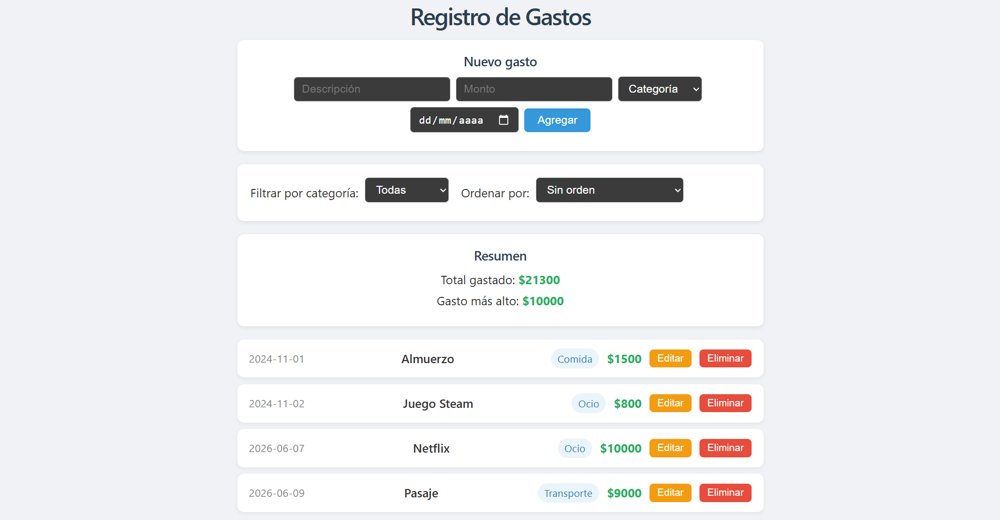

# Registro de Gastos

Aplicación web desarrollada con React que permite llevar un registro personal de gastos.

## Captura de pantalla de la aplicación funcionando



## ¿Qué hace la aplicación?

Permite al usuario:

- Ver la lista de gastos registrados, cargados desde un backend REST al iniciar la aplicación.
- Agregar nuevos gastos completando un formulario con descripción, monto, categoría y fecha.
- Editar un gasto existente directamente desde la lista.
- Eliminar gastos de la lista y del backend.
- Filtrar los gastos por categoría.
- Ordenar los gastos por fecha o por monto.
- Ver el total gastado y el gasto más alto, tanto del total general como del filtro activo.
- Ver un mensaje de carga mientras se obtienen los datos del servidor.
- Ver un mensaje de error si el servidor no está disponible.

## ¿Cómo se ejecuta?

### Requisitos previos

- Node.js instalado
- json-server instalado globalmente (`npm install -g json-server`)

### Pasos

1. Clonar el repositorio e instalar las dependencias:

```bash
git clone https://github.com/silvajosefina/registro-gastos.git
cd registro-gastos
npm install
```

2. Iniciar el backend (en una terminal):

```bash
json-server --watch db.json --port 3001
```

3. Iniciar el frontend (en otra terminal):

```bash
npm run dev
```

4. Abrir el navegador en `http://localhost:5173`

## Conceptos de React utilizados

- **useState**: para manejar el estado local de los componentes (lista de gastos, categorías, filtro, orden, carga, errores) y los campos de los formularios.
- **useEffect**: para obtener los gastos y las categorías desde el backend al montar el componente principal.
- **Props**: para comunicar datos y funciones entre componentes padre e hijo (por ejemplo, pasar `onAgregar`, `onEliminar` y `onEditar` desde `App` hacia los componentes hijos).
- **Componentes funcionales**: toda la aplicación está construida con componentes funcionales, siguiendo las prácticas del curso Fullstack Open.
- **Renderizado condicional**: para mostrar el formulario de edición, el mensaje de carga y el mensaje de error según el estado de la aplicación.
- **Listas y keys**: para renderizar la lista de gastos usando `.map()` con el atributo `key` en cada elemento.
- **Inmutabilidad del estado**: el estado nunca se modifica directamente; se actualizan siempre mediante copias usando `.concat()`, `.map()` y `.filter()`.
- **Separación de responsabilidades**: la lógica de comunicación con el backend está separada en `services/gastos.js`, manteniendo los componentes enfocados en la interfaz.